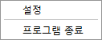
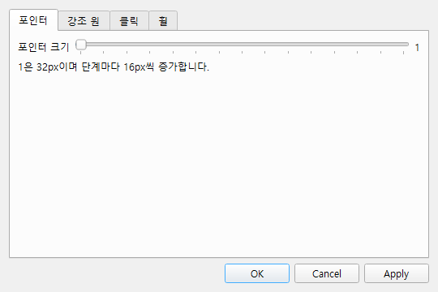
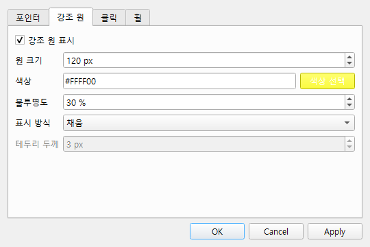
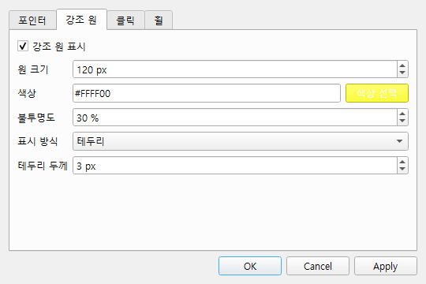
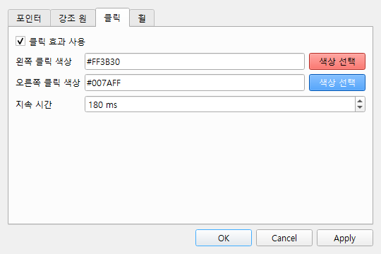
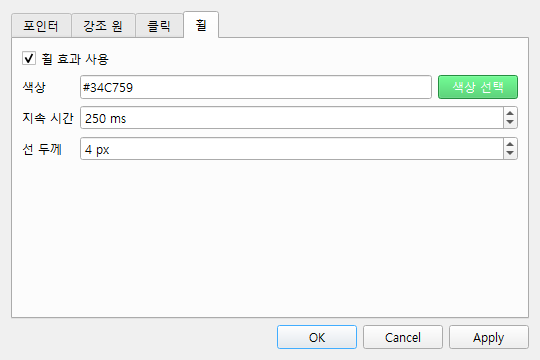

# Spotlight

Spotlight는 마우스 포인터와 클릭·휠 동작을 화면에서 쉽게 알아볼 수 있도록 표시하는 Windows 프로그램입니다. 프레젠테이션, 강의, 화면 녹화처럼 마우스 움직임을 분명하게 전달해야 할 때 사용할 수 있습니다.

실행 중에는 작업표시줄에 일반 창을 만들지 않고 Windows 시스템 트레이에서 동작합니다.

## 주요 기능

- 마우스 포인터 크기 조절
- 포인터 주변 강조 원 표시
- 강조 원의 크기, 색상, 불투명도 설정
- 채움 또는 테두리 표시 방식 선택
- 왼쪽·오른쪽 클릭 효과와 색상 설정
- 마우스 휠 방향 애니메이션 표시
- 종료 시 원래 Windows 커서 자동 복원

## 실행과 종료

`spotlight.exe`를 더블 클릭해 실행합니다. 실행 후 Windows 알림 영역의 Spotlight 아이콘을 마우스 오른쪽 버튼으로 누르면 메뉴가 나타납니다.



- `설정`: 설정 화면을 엽니다.
- `프로그램 종료`: Spotlight를 종료하고 원래 시스템 커서를 복원합니다.

커서를 안전하게 복원할 수 있도록 창을 강제로 닫기보다 트레이 메뉴의 `프로그램 종료`를 사용하세요.

## 설정

### 포인터



포인터 크기는 1~15단계로 조절할 수 있습니다. 1단계는 32px이며 단계마다 16px씩 커집니다.

- 슬라이더를 움직이면 변경될 크기를 바로 미리 볼 수 있습니다.
- `Apply`는 현재 크기를 저장하고 설정 창을 유지합니다.
- `확인`은 현재 크기를 저장하고 설정 창을 닫습니다.
- `취소`는 마지막으로 저장한 크기로 되돌리고 설정 창을 닫습니다.

### 강조 원



포인터 주변에 표시되는 강조 원을 켜거나 끄고 다음 항목을 조절할 수 있습니다.

- 원 크기
- 색상 선택 또는 `#RRGGBB` 직접 입력
- 불투명도
- 채움 또는 테두리 표시 방식
- 테두리 방식의 선 두께



강조 원의 크기는 클릭 효과의 최대 크기와 휠 효과의 바깥 크기에도 적용됩니다.

### 클릭 효과



왼쪽 클릭과 오른쪽 클릭의 색상을 각각 지정하고 효과의 지속 시간을 설정할 수 있습니다. 클릭하면 해당 위치에 불투명한 원형 효과가 나타납니다.


### 휠 효과



휠 효과의 색상, 지속 시간, 선 두께를 설정할 수 있습니다.

- 휠을 위로 움직이면 원이 안쪽에서 바깥쪽으로 커집니다.
- 휠을 아래로 움직이면 원이 바깥쪽에서 안쪽으로 작아집니다.


## 소스에서 실행

Python 3.14 이상 환경에서 의존성을 설치한 후 실행합니다.

```powershell
python -m pip install -r requirements.txt
python run_spotlight.py
```

## 실행 파일 빌드

빌드 의존성을 설치하고 프로젝트 루트에서 빌드 스크립트를 실행합니다.

```powershell
python -m pip install -r requirements-build.txt
powershell -ExecutionPolicy Bypass -File .\build.ps1
```

빌드된 단일 실행 파일은 `dist\spotlight.exe`에 생성됩니다. 자세한 내용은 [빌드 안내](docs/BUILD.md)를 참고하세요.

## 문제 해결

### 트레이 아이콘이 보이지 않아요

Windows 알림 영역의 숨겨진 아이콘 목록을 확인하세요. Spotlight는 작업표시줄에 일반 창을 표시하지 않습니다.

### 커서가 원래 크기로 돌아오지 않아요

Spotlight를 다시 실행하면 이전 실행의 복구 표식을 확인하여 저장된 Windows 커서 구성을 복원합니다. 이후 트레이 메뉴에서 정상적으로 종료하세요.

### 특정 프로그램에서 클릭이나 휠 효과가 나타나지 않아요

Spotlight를 일반 권한으로 실행하면 관리자 권한 프로그램의 입력을 감지하지 못할 수 있습니다. 관리자 권한 프로그램에 대한 입력 감지는 현재 공식 지원 범위에 포함되지 않습니다.

### 화면 녹화에 효과가 포함되지 않아요

전체 화면 또는 디스플레이 캡처를 사용하세요. 특정 창만 캡처하면 별도의 Spotlight 오버레이가 제외될 수 있습니다.

## 사용자 가이드

더 자세한 사용법은 [Spotlight 사용설명서](docs/SPOTLIGHT_USER_GUIDE.md)에서 확인할 수 있습니다.
